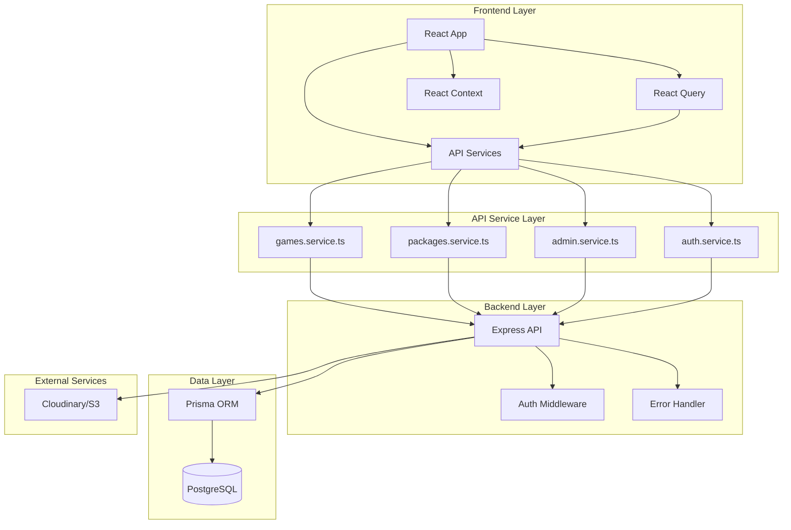

# Design Document: Admin Dashboard Dynamic Content

## Overview

This design document details the architecture and implementation approach for transforming the Medo Store from a static hardcoded system to a fully dynamic, admin-driven content management system. The system will:

- Remove all hardcoded game data from the frontend
- Implement a complete API service layer for frontend-backend communication
- Integrate React Query for efficient data fetching, caching, and state management
- Build a comprehensive admin dashboard for managing games, packages, and inventory
- Implement a robust image upload system supporting cloud storage
- Provide real-time statistics and analytics
- Support bilingual content (Arabic/English)

**Key Technologies:**
- **Frontend:** React + TypeScript + Vite
- **Backend:** Node.js + Express + Prisma ORM
- **Database:** PostgreSQL
- **State Management:** React Query (TanStack Query) + React Context
- **UI Components:** shadcn/ui + Tailwind CSS
- **Image Storage:** Cloudinary or AWS S3
- **Authentication:** JWT tokens

## Architecture

### System Architecture Overview



### Data Flow Architecture

**Customer Flow:**
1. User visits homepage → React Query fetches games → Cache for 5 minutes
2. User clicks game → Fetch game details + packages → Cache for 10 minutes
3. User places order → POST to backend → Invalidate relevant caches

**Admin Flow:**
1. Admin logs in → JWT token stored
2. Admin creates/updates content → POST/PUT to backend
3. Backend processes → Database updated
4. Cache invalidated → Frontend refetches fresh data
5. Statistics dashboard updates in real-time

### Component Architecture

```
src/
├── app/
│   ├── components/
│   │   ├── admin/
│   │   │   ├── AdminLayout.tsx
│   │   │   ├── AdminSidebar.tsx
│   │   │   ├── GameForm.tsx
│   │   │   ├── PackageForm.tsx
│   │   │   ├── ImageUpload.tsx
│   │   │   └── StatsCard.tsx
│   │   ├── ui/              # shadcn/ui components
│   │   ├── GameCard.tsx
│   │   ├── ProductCard.tsx
│   │   └── ProtectedRoute.tsx
│   ├── pages/
│   │   ├── admin/
│   │   │   ├── Dashboard.tsx
│   │   │   ├── GamesManagement.tsx
│   │   │   ├── PackagesManagement.tsx
│   │   │   └── Statistics.tsx
│   │   ├── Home.tsx
│   │   ├── Games.tsx
│   │   └── GameDetail.tsx
│   └── hooks/
│       ├── useGames.ts
│       ├── useGame.ts
│       ├── usePackages.ts
│       ├── useCreateGame.ts
│       ├── useUpdateGame.ts
│       └── useDeleteGame.ts
├── services/
│   ├── api.ts
│   ├── games.service.ts
│   ├── packages.service.ts
│   ├── admin.service.ts
│   └── types.ts
└── lib/
    └── queryClient.ts
```

## Components and Interfaces

### API Service Layer

#### 1. Base API Configuration (api.ts)

**Responsibilities:**
- Configure Axios instance with base URL
- Implement request/response interceptors
- Handle token refresh logic
- Centralize error handling

**Key Features:**
- Automatic token injection in request headers
- Token refresh on 401 errors
- Network error handling
- Request timeout configuration (10 seconds)

#### 2. Games Service (games.service.ts)

```typescript
interface Game {
  id: string;
  name: string;
  nameAr: string;
  slug: string;
  description?: string;
  descriptionAr?: string;
  image: string;
  category: string;
  isActive: boolean;
  sortOrder: number;
  createdAt: Date;
  updatedAt: Date;
}

interface GetGamesParams {
  category?: string;
  isActive?: boolean;
  search?: string;
  page?: number;
  limit?: number;
}

interface GetGamesResponse {
  games: Game[];
  pagination: {
    page: number;
    limit: number;
    total: number;
    totalPages: number;
  };
}

// Methods
getAllGames(params: GetGamesParams): Promise<GetGamesResponse>
getGameById(gameId: string): Promise<Game>
getGameBySlug(slug: string): Promise<Game>
```

#### 3. Packages Service (packages.service.ts)

```typescript
interface Package {
  id: string;
  gameId: string;
  game?: Game;
  amount: string;
  price: number;
  oldPrice?: number;
  isPopular: boolean;
  isActive: boolean;
  stock: number;
  sortOrder: number;
  createdAt: Date;
  updatedAt: Date;
}

interface GetPackagesParams {
  gameId?: string;
  isPopular?: boolean;
  isActive?: boolean;
  minPrice?: number;
  maxPrice?: number;
  page?: number;
  limit?: number;
}

// Methods
getAllPackages(params: GetPackagesParams): Promise<PackagesResponse>
getPackagesByGameId(gameId: string): Promise<Package[]>
getPopularPackages(limit?: number): Promise<Package[]>
```

#### 4. Admin Service (admin.service.ts)

```typescript
interface CreateGameData {
  name: string;
  nameAr: string;
  description?: string;
  descriptionAr?: string;
  image: string;
  category: string;
  sortOrder?: number;
}

interface UpdateGameData {
  name?: string;
  nameAr?: string;
  description?: string;
  descriptionAr?: string;
  image?: string;
  category?: string;
  isActive?: boolean;
  sortOrder?: number;
}

interface DashboardStats {
  users: {
    total: number;
    active: number;
    verified: number;
    newThisMonth: number;
  };
  orders: {
    total: number;
    pending: number;
    processing: number;
    completed: number;
    totalRevenue: number;
    averageOrderValue: number;
  };
  games: {
    total: number;
    active: number;
  };
  packages: {
    total: number;
    popular: number;
  };
}

// Methods
createGame(data: CreateGameData): Promise<Game>
updateGame(gameId: string, data: UpdateGameData): Promise<Game>
deleteGame(gameId: string): Promise<void>
createPackage(data: CreatePackageData): Promise<Package>
updatePackage(packageId: string, data: UpdatePackageData): Promise<Package>
deletePackage(packageId: string): Promise<void>
getDashboardStats(): Promise<DashboardStats>
uploadImage(file: File): Promise<{ url: string }>
```

### React Query Hooks

#### Custom Hooks Structure

**Query Hooks (Data Fetching):**
```typescript
// useGames.ts
export function useGames(params?: GetGamesParams) {
  return useQuery({
    queryKey: ['games', params],
    queryFn: () => gamesService.getAllGames(params),
    staleTime: 5 * 60 * 1000, // 5 minutes
    gcTime: 10 * 60 * 1000 // 10 minutes
  });
}

// useGame.ts
export function useGame(gameId: string) {
  return useQuery({
    queryKey: ['game', gameId],
    queryFn: () => gamesService.getGameById(gameId),
    staleTime: 10 * 60 * 1000, // 10 minutes
    enabled: !!gameId
  });
}

// usePackages.ts
export function usePackages(params?: GetPackagesParams) {
  return useQuery({
    queryKey: ['packages', params],
    queryFn: () => packagesService.getAllPackages(params),
    staleTime: 5 * 60 * 1000
  });
}
```

**Mutation Hooks (Data Modification):**
```typescript
// useCreateGame.ts
export function useCreateGame() {
  const queryClient = useQueryClient();
  
  return useMutation({
    mutationFn: (data: CreateGameData) => adminService.createGame(data),
    onSuccess: () => {
      queryClient.invalidateQueries({ queryKey: ['games'] });
      toast.success('Game created successfully');
    },
    onError: (error) => {
      toast.error(error.message);
    }
  });
}

// useUpdateGame.ts
export function useUpdateGame() {
  const queryClient = useQueryClient();
  
  return useMutation({
    mutationFn: ({ gameId, data }: { gameId: string; data: UpdateGameData }) =>
      adminService.updateGame(gameId, data),
    onSuccess: (_, variables) => {
      queryClient.invalidateQueries({ queryKey: ['games'] });
      queryClient.invalidateQueries({ queryKey: ['game', variables.gameId] });
      toast.success('Game updated successfully');
    },
    onError: (error) => {
      toast.error(error.message);
    }
  });
}

// useDeleteGame.ts
export function useDeleteGame() {
  const queryClient = useQueryClient();
  
  return useMutation({
    mutationFn: (gameId: string) => adminService.deleteGame(gameId),
    onSuccess: () => {
      queryClient.invalidateQueries({ queryKey: ['games'] });
      toast.success('Game deleted successfully');
    },
    onError: (error) => {
      toast.error(error.message);
    }
  });
}
```

### Admin Dashboard Components

#### 1. Admin Layout

```typescript
interface AdminLayoutProps {
  children: React.ReactNode;
}

// Features:
- Responsive sidebar navigation
- Top header with user info and logout
- Mobile-friendly hamburger menu
- Breadcrumb navigation
- Persistent sidebar state in localStorage
```

#### 2. Games Management

**Table Columns:**
- Image (thumbnail)
- Name (English)
- Name (Arabic)
- Category
- Status (Active/Inactive toggle)
- Packages Count
- Actions (Edit, Delete, View)

**Features:**
- Search by name (debounced)
- Filter by category
- Sort by name, category, creation date
- Pagination (20 items per page)
- Bulk actions (activate, deactivate)
- Drag-and-drop reordering (sortOrder)

**Game Form:**
```typescript
interface GameFormData {
  name: string;
  nameAr: string;
  description?: string;
  descriptionAr?: string;
  image: string;
  category: string;
  sortOrder?: number;
}

// Validation Rules:
- name: required, min 2 chars
- nameAr: required, min 2 chars
- image: required, valid URL or file upload
- category: required, not empty
- sortOrder: optional, integer >= 0
```

#### 3. Packages Management

**Table Columns:**
- Game Name
- Amount
- Price (SDG)
- Old Price (if discounted)
- Popular Badge
- Stock (with low stock warning < 10)
- Status Toggle
- Actions

**Features:**
- Filter by game
- Filter by price range
- Sort by price, amount, popularity
- Quick stock update
- Bulk popular/unpopular toggle
- Low stock alerts

**Package Form:**
```typescript
interface PackageFormData {
  gameId: string;
  amount: string;
  price: number;
  oldPrice?: number;
  isPopular: boolean;
  stock: number;
  sortOrder?: number;
}

// Validation Rules:
- gameId: required
- amount: required, not empty
- price: required, number > 0
- oldPrice: optional, number > price (if provided)
- stock: required, integer >= 0
```

#### 4. Image Upload Component

```typescript
interface ImageUploadProps {
  value?: string;
  onChange: (url: string) => void;
  onRemove: () => void;
}

// Features:
- Drag and drop support
- File picker button
- Image preview
- Progress indicator during upload
- File type validation (JPEG, PNG, WebP, GIF)
- File size validation (max 5MB)
- Image optimization before upload
- Cloudinary/S3 integration
```

**Upload Process:**
1. User selects/drops image
2. Frontend validates file type and size
3. Image optimized (resize, compress)
4. Upload to cloud storage with progress
5. Cloud service returns URL
6. URL saved to database

#### 5. Statistics Dashboard

**Dashboard Cards:**
```typescript
interface StatCard {
  title: string;
  value: number | string;
  icon: React.ComponentType;
  trend?: {
    value: number;
    isPositive: boolean;
  };
  color: string;
}

// Cards:
1. Total Active Games
2. Total Available Packages
3. Total Revenue (from completed orders)
4. Total Orders
5. Top 5 Popular Games (chart)
6. Low Stock Packages (list)
7. Recent Orders (table)
```

**Features:**
- Date range filter (today, week, month, custom)
- Real-time updates (WebSocket or polling)
- Export to CSV/PDF
- Interactive charts (using recharts)
- Responsive grid layout

## Data Models

### Frontend Data Models

```typescript
// Game Model
interface Game {
  id: string;
  name: string;
  nameAr: string;
  slug: string;
  description?: string;
  descriptionAr?: string;
  image: string;
  category: string;
  isActive: boolean;
  sortOrder: number;
  packages?: Package[];
  createdAt: Date;
  updatedAt: Date;
}

// Package Model
interface Package {
  id: string;
  gameId: string;
  game?: Game;
  amount: string;
  price: number;
  oldPrice?: number;
  isPopular: boolean;
  isActive: boolean;
  stock: number;
  sortOrder: number;
  createdAt: Date;
  updatedAt: Date;
}

// Order Model (for statistics)
interface Order {
  id: string;
  orderNumber: string;
  userId: string;
  user?: User;
  status: OrderStatus;
  paymentStatus: PaymentStatus;
  subtotal: number;
  discount: number;
  total: number;
  items: OrderItem[];
  createdAt: Date;
  completedAt?: Date;
}

// Dashboard Stats Model
interface DashboardStats {
  users: {
    total: number;
    active: number;
    verified: number;
    newThisMonth: number;
  };
  orders: {
    total: number;
    pending: number;
    processing: number;
    completed: number;
    totalRevenue: number;
    averageOrderValue: number;
  };
  games: {
    total: number;
    active: number;
  };
  packages: {
    total: number;
    popular: number;
  };
}

// Enums
enum OrderStatus {
  PENDING = 'PENDING',
  PROCESSING = 'PROCESSING',
  COMPLETED = 'COMPLETED',
  CANCELLED = 'CANCELLED',
  REFUNDED = 'REFUNDED'
}

enum PaymentStatus {
  PENDING = 'PENDING',
  PAID = 'PAID',
  FAILED = 'FAILED',
  REFUNDED = 'REFUNDED'
}
```

## Error Handling

### Error Handling Strategy

**Frontend Error Types:**
```typescript
enum ErrorType {
  NETWORK = 'NETWORK',
  VALIDATION = 'VALIDATION',
  AUTHENTICATION = 'AUTHENTICATION',
  AUTHORIZATION = 'AUTHORIZATION',
  NOT_FOUND = 'NOT_FOUND',
  SERVER = 'SERVER',
  UNKNOWN = 'UNKNOWN'
}

interface AppError {
  type: ErrorType;
  message: string;
  messageAr: string;
  details?: any;
}
```

**Error Handling Flow:**
1. API service catches error
2. Error type determined
3. Appropriate error message selected (English/Arabic)
4. Toast notification displayed
5. Error logged to console (development)
6. User-friendly error component shown (if needed)

**Error Messages:**
```typescript
const errorMessages = {
  NETWORK: {
    en: 'Connection error. Please check your internet connection.',
    ar: 'خطأ في الاتصال. يرجى التحقق من اتصالك بالإنترنت.'
  },
  AUTHENTICATION: {
    en: 'Unauthorized access. Please log in.',
    ar: 'وصول غير مصرح به. يرجى تسجيل الدخول.'
  },
  NOT_FOUND: {
    en: 'Resource not found.',
    ar: 'المورد غير موجود.'
  },
  SERVER: {
    en: 'Server error. Please try again later.',
    ar: 'خطأ في الخادم. يرجى المحاولة لاحقاً.'
  },
  VALIDATION: {
    en: 'Validation error. Please check your input.',
    ar: 'خطأ في التحقق. يرجى التحقق من المدخلات.'
  }
};
```

### Retry Logic

**Automatic Retry:**
- Network errors: 3 retries with exponential backoff
- Server errors (500, 502, 503): 2 retries
- Timeout errors: 2 retries

**React Query Retry Configuration:**
```typescript
const queryClient = new QueryClient({
  defaultOptions: {
    queries: {
      retry: (failureCount, error) => {
        if (error.response?.status === 404) return false;
        if (error.response?.status === 401) return false;
        if (failureCount >= 3) return false;
        return true;
      },
      retryDelay: (attemptIndex) => Math.min(1000 * 2 ** attemptIndex, 30000),
    },
  },
});
```

## Testing Strategy

### Testing Approach

**1. Unit Tests:**
- Test API service methods
- Test custom hooks (using React Query Testing Library)
- Test utility functions
- Test form validation logic

**2. Integration Tests:**
- Test complete user flows (game creation, package creation)
- Test admin dashboard workflows
- Test authentication and authorization

**3. Property-Based Testing:**
Not applicable for this feature as it primarily involves UI components, API integration, configuration validation, and CRUD operations. These are better suited for example-based tests and integration tests.

**Alternative Testing Strategies:**
- **Snapshot Tests:** For UI components (GameCard, ProductCard, Admin forms)
- **Mock-Based Tests:** For API service layer and React Query hooks
- **Integration Tests:** For complete workflows (create game → upload image → verify database)
- **Visual Regression Tests:** For admin dashboard layouts and customer-facing pages

**4. E2E Tests (Optional):**
- Test complete admin workflows
- Test customer purchase flow
- Test authentication flow

### Test Coverage Goals

- Unit tests: 80% coverage
- Integration tests: Critical paths covered
- E2E tests: Main user journeys covered

## Security & Authentication

### Authentication Flow

**Login Flow:**
1. User submits credentials
2. Backend validates and returns access + refresh tokens
3. Tokens stored in localStorage
4. Access token added to all requests via interceptor

**Token Refresh:**
1. API call returns 401
2. Interceptor catches error
3. Refresh token sent to backend
4. New access token received
5. Original request retried with new token
6. If refresh fails → logout user

**Authorization:**
- Protected routes check user role
- Admin routes require ADMIN or SUPER_ADMIN role
- Backend validates role on every admin API call

### Security Best Practices

1. **Input Validation:**
   - Frontend validation (immediate feedback)
   - Backend validation (security)
   - XSS prevention (sanitize all inputs)

2. **API Security:**
   - HTTPS only in production
   - CORS configuration
   - Rate limiting
   - Request size limits

3. **Data Security:**
   - Passwords hashed (bcrypt)
   - Sensitive data not logged
   - SQL injection prevention (Prisma ORM)

4. **File Upload Security:**
   - File type validation
   - File size limits
   - Virus scanning (optional)
   - Secure storage permissions

## Performance Optimizations

### Frontend Optimizations

**1. React Query Caching:**
```typescript
const queryClient = new QueryClient({
  defaultOptions: {
    queries: {
      staleTime: 5 * 60 * 1000, // 5 minutes
      gcTime: 10 * 60 * 1000, // 10 minutes
      refetchOnWindowFocus: false,
      refetchOnReconnect: true,
    },
  },
});
```

**2. Code Splitting:**
- Lazy load admin routes
- Lazy load heavy components
- Use React.lazy() and Suspense

```typescript
const AdminDashboard = lazy(() => import('./pages/admin/Dashboard'));
const GamesManagement = lazy(() => import('./pages/admin/GamesManagement'));
```

**3. Image Optimization:**
- Responsive images (srcset)
- Lazy loading images
- WebP format with fallbacks
- CDN caching

**4. Debouncing:**
- Search inputs debounced (300ms)
- Auto-save debounced (1000ms)

**5. Pagination:**
- Server-side pagination
- Virtual scrolling for large lists (optional)

### Backend Optimizations

**1. Database Queries:**
- Index on frequently queried fields (slug, gameId)
- Use Prisma `select` to fetch only needed fields
- Batch queries where possible

**2. Caching:**
- Cache frequently accessed data (games list, popular packages)
- Redis cache (optional, future enhancement)

**3. Response Compression:**
- Gzip compression enabled
- Minify JSON responses

## Deployment Considerations

### Environment Configuration

**Development:**
```env
VITE_API_URL=http://localhost:5000/api
VITE_UPLOAD_URL=http://localhost:5000/uploads
```

**Production:**
```env
VITE_API_URL=https://api.medostore.com/api
VITE_UPLOAD_URL=https://cdn.medostore.com
VITE_CLOUDINARY_CLOUD_NAME=your_cloud_name
VITE_CLOUDINARY_UPLOAD_PRESET=your_preset
```

### Build Optimization

**Vite Configuration:**
```typescript
export default defineConfig({
  build: {
    rollupOptions: {
      output: {
        manualChunks: {
          'vendor': ['react', 'react-dom', 'react-router-dom'],
          'query': ['@tanstack/react-query'],
          'ui': ['@radix-ui/react-*'],
        },
      },
    },
    chunkSizeWarningLimit: 1000,
  },
});
```

### Monitoring & Logging

**Frontend Monitoring:**
- Error tracking (Sentry or similar)
- Performance monitoring (Web Vitals)
- User analytics (Google Analytics)

**Backend Monitoring:**
- API response times
- Error rates
- Database query performance

## Migration Strategy

### Phase 1: API Service Layer (Week 1)
1. Create API service files
2. Implement all service methods
3. Add TypeScript types
4. Test API endpoints

### Phase 2: React Query Integration (Week 1-2)
1. Setup QueryClient
2. Create custom hooks
3. Replace static data in Home.tsx
4. Replace static data in Games.tsx
5. Replace static data in GameDetail.tsx

### Phase 3: Admin Dashboard (Week 2-3)
1. Create admin layout
2. Implement games management
3. Implement packages management
4. Add image upload
5. Create statistics dashboard

### Phase 4: Testing & Polish (Week 3-4)
1. Unit tests
2. Integration tests
3. Bug fixes
4. Performance optimization
5. Documentation

### Phase 5: Deployment (Week 4)
1. Production build
2. Deploy to staging
3. User acceptance testing
4. Deploy to production
5. Monitor and support

## Bilingual Support

### Translation Strategy

**Translation Files Structure:**
```typescript
// translations.ts
const translations = {
  en: {
    // Customer-facing
    heroTitle: 'Your Gaming Store',
    browseGames: 'Browse Games',
    // Admin dashboard
    dashboard: 'Dashboard',
    gamesManagement: 'Games Management',
    packagesManagement: 'Packages Management',
    statistics: 'Statistics',
    addGame: 'Add Game',
    editGame: 'Edit Game',
    deleteGame: 'Delete Game',
    confirmDelete: 'Are you sure you want to delete this game?',
    // Form labels
    gameName: 'Game Name',
    gameNameArabic: 'Game Name (Arabic)',
    category: 'Category',
    image: 'Image',
    description: 'Description',
    // Success/Error messages
    gameCreated: 'Game created successfully',
    gameUpdated: 'Game updated successfully',
    gameDeleted: 'Game deleted successfully',
    errorCreatingGame: 'Error creating game',
    // Validation
    fieldRequired: 'This field is required',
    invalidPrice: 'Price must be a positive number',
  },
  ar: {
    // Customer-facing
    heroTitle: 'متجر الألعاب الخاص بك',
    browseGames: 'تصفح الألعاب',
    // Admin dashboard
    dashboard: 'لوحة التحكم',
    gamesManagement: 'إدارة الألعاب',
    packagesManagement: 'إدارة الباقات',
    statistics: 'الإحصائيات',
    addGame: 'إضافة لعبة',
    editGame: 'تعديل لعبة',
    deleteGame: 'حذف لعبة',
    confirmDelete: 'هل أنت متأكد من حذف هذه اللعبة؟',
    // Form labels
    gameName: 'اسم اللعبة',
    gameNameArabic: 'اسم اللعبة (بالعربية)',
    category: 'الفئة',
    image: 'الصورة',
    description: 'الوصف',
    // Success/Error messages
    gameCreated: 'تم إنشاء اللعبة بنجاح',
    gameUpdated: 'تم تحديث اللعبة بنجاح',
    gameDeleted: 'تم حذف اللعبة بنجاح',
    errorCreatingGame: 'خطأ في إنشاء اللعبة',
    // Validation
    fieldRequired: 'هذا الحقل مطلوب',
    invalidPrice: 'يجب أن يكون السعر رقماً موجباً',
  }
};
```

**RTL Support:**
```typescript
// Add to layout components
useEffect(() => {
  document.documentElement.dir = language === 'ar' ? 'rtl' : 'ltr';
  document.documentElement.lang = language;
}, [language]);
```

## Accessibility

### Accessibility Guidelines

**1. Semantic HTML:**
- Use proper heading hierarchy
- Use semantic elements (nav, main, section, article)
- Use proper form labels

**2. Keyboard Navigation:**
- All interactive elements accessible via keyboard
- Visible focus indicators
- Logical tab order

**3. ARIA Attributes:**
- aria-label for icon buttons
- aria-describedby for form validation errors
- aria-live for dynamic content updates

**4. Color Contrast:**
- Minimum 4.5:1 for normal text
- Minimum 3:1 for large text
- Don't rely on color alone for information

**5. Screen Reader Support:**
- Alt text for images
- Descriptive link text
- Form error announcements

## Future Enhancements

### Phase 2 Enhancements (Optional)

1. **Activity Logging:**
   - Log all admin actions
   - Activity log viewer
   - Filter by user, action type, date

2. **Bulk Operations:**
   - Select multiple games/packages
   - Bulk activate/deactivate
   - Bulk delete (with confirmation)

3. **Advanced Search:**
   - Full-text search
   - Search across multiple fields
   - Search suggestions

4. **Export Functionality:**
   - Export games list to CSV/Excel
   - Export packages list to CSV/Excel
   - Export statistics reports

5. **Notifications:**
   - Low stock alerts
   - Email notifications for new orders
   - WebSocket real-time updates

6. **Advanced Analytics:**
   - Sales trends over time
   - Revenue forecasting
   - Customer behavior analysis

7. **Image Management:**
   - Multiple images per game
   - Image gallery
   - Image editor integration

8. **Drag-and-Drop Reordering:**
   - Visual game reordering
   - Package reordering within games
   - Category management

## Conclusion

This design provides a comprehensive blueprint for transforming Medo Store into a fully dynamic, admin-driven platform. The architecture prioritizes:

- **Scalability:** Modular architecture allows easy addition of new features
- **Performance:** React Query caching and optimization strategies ensure fast load times
- **Maintainability:** Clean separation of concerns and TypeScript types
- **User Experience:** Smooth admin workflows and customer-facing pages
- **Security:** JWT authentication, input validation, and role-based access control
- **Bilingual Support:** Complete Arabic and English translations

The implementation will be phased to allow for iterative development and testing, ensuring a smooth transition from the static system to the dynamic platform.
